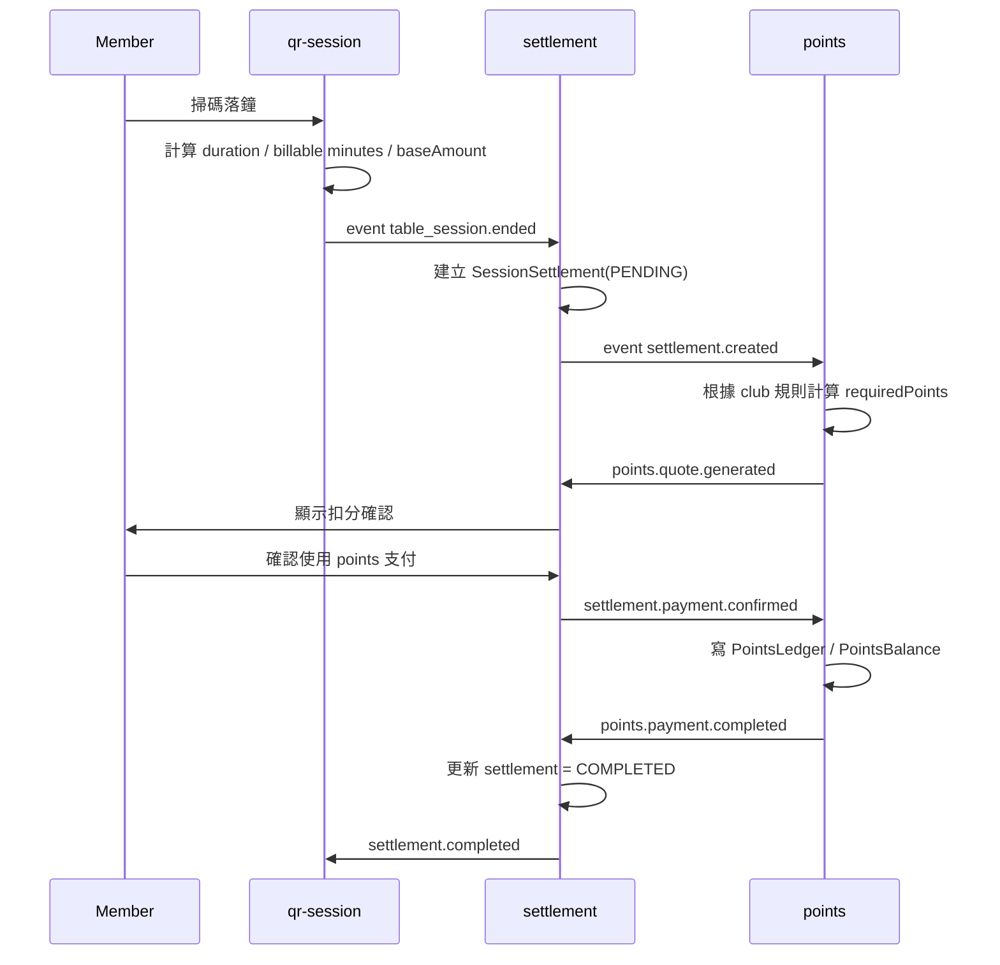

# QR Session -> Settlement -> Points 插件式流程設計

## 1. 目標

本文件針對以下目標設計一條更獨立的交易鏈：

- `qr-session` 只負責上鐘、落鐘、計時、產出結算請求
- `settlement` 負責建立交易、管理狀態、串接支付插件
- `points` 只負責積分換算、確認扣分、寫入 ledger / balance

核心原則：

- `qr-session` 不直接寫 `PointsLedger`
- `qr-session` 不直接寫 `PointsBalance`
- `points` 不直接接管 `TableSession` 的生命週期
- 雙方只透過 `settlement` 與事件 contract 互動

這樣可以讓：

- `qr-session` 成為純計時插件
- `points` 成為純支付插件
- 未來增加 `cash`、`wallet`、`package` 等支付方式時，不需要重寫 session 流程

## 2. 新分層角色

### 2.1 Core

Core 只提供：

- `Member`
- `ClubProfile`
- `Auth`
- `FeatureFlag`
- `ClubFeatureAccess`
- `PluginRegistry`
- `EventBus / Outbox`

### 2.2 QR Session Plugin

職責：

- 上鐘
- 落鐘
- 計算用時
- 計算 billable minutes
- 產出 session 結算請求

不負責：

- 積分換算
- 積分餘額檢查
- 扣分交易完成

### 2.3 Settlement Plugin

職責：

- 建立交易主檔
- 管理交易狀態
- 決定支付方式
- 將交易分派給指定支付插件
- 聚合支付結果

不負責：

- session 計時
- points 規則本身

### 2.4 Points Plugin

職責：

- 根據場館規則計算應扣積分
- 檢查會員餘額
- 等待會員確認
- 扣分
- 寫入 `PointsLedger`
- 更新 `PointsBalance`

不負責：

- session 起鐘/落鐘
- 決定本次 session 是否結束

## 3. 建議流程

## 3.1 正常交易流程

1. 會員掃碼落鐘
2. `qr-session` 計算：
   - `durationMinutes`
   - `billableMinutes`
   - `baseAmount`
3. `qr-session` 發出 `table_session.ended`
4. `settlement` 根據事件建立 `SessionSettlement`
5. `settlement` 發出 `settlement.created`
6. `points` 收到事件後建立 quote：
   - `requiredPoints`
   - `currency`
   - `baseAmount`
7. 前端顯示會員確認畫面
8. 會員確認扣分
9. `points` 寫入：
   - `PointsLedger`
   - `PointsBalance`
10. `points` 發出 `points.payment.completed`
11. `settlement` 將交易更新為 `COMPLETED`
12. `settlement` 發出 `settlement.completed`
13. `qr-session` 可讀取結果作展示，但不直接寫 points 表

## 3.2 Mermaid 流程圖



## 4. 與目前做法的差異

### 4.1 現況

目前偏向：

- `qr-session` 結束時直接計算應扣積分
- `qr-session` 直接寫 `PointsLedger`
- `qr-session` 直接寫 `PointsBalance`

問題：

- `qr-session` 知道太多 `points` 內部細節
- 之後若引入其他支付方式，session 模組會被迫修改
- 測試、審計、失敗重試都會混在同一個 use case

### 4.2 改良後

改成：

- `qr-session` 只負責產出「待結算資料」
- `settlement` 管理交易主流程
- `points` 只管理積分支付

效果：

- 模組更獨立
- 職責更清晰
- 後續支付插件更易替換

## 5. 建議資料表

### 5.1 保留原有表

- `TableSession`
- `TableSessionConfirm`
- `ClubPointsConfig`
- `PointsLedger`
- `PointsBalance`

### 5.2 新增 settlement 主表

建議新增：`SessionSettlement`

欄位建議：

- `id`
- `sessionId`
- `clubId`
- `memberId`
- `tableId`
- `paymentMethod`
- `status`
- `durationMinutes`
- `billableMinutes`
- `baseAmount`
- `chargedAmount`
- `chargedCurrency`
- `quotePayload`
- `confirmedAt`
- `completedAt`
- `failedAt`
- `failureReason`
- `createdAt`
- `updatedAt`

說明：

- `paymentMethod` 例如：`POINTS` / `CASH` / `WALLET`
- `status` 例如：`PENDING` / `QUOTED` / `AWAITING_CONFIRMATION` / `PROCESSING` / `COMPLETED` / `FAILED` / `CANCELLED`
- `quotePayload` 用來保留當下換算結果，避免事後規則變動造成審計困難

### 5.3 新增 settlement attempt 表

建議新增：`SessionSettlementAttempt`

欄位建議：

- `id`
- `settlementId`
- `providerKey`
- `status`
- `requestPayload`
- `responsePayload`
- `failureReason`
- `createdAt`

用途：

- 記錄每一次呼叫 `points` 或其他支付插件的嘗試
- 方便重試與審計

### 5.4 新增 outbox 表

建議新增：`DomainEventOutbox`

欄位建議：

- `id`
- `eventType`
- `aggregateType`
- `aggregateId`
- `payload`
- `createdAt`
- `processedAt`
- `failedAt`

## 6. 事件契約

## 6.1 `table_session.ended`

發送者：`qr-session`

```json
{
  "sessionId": "ts_123",
  "clubId": "club_1",
  "memberId": "member_1",
  "tableId": "table_8",
  "durationMinutes": 97,
  "billableMinutes": 105,
  "baseAmount": "140.00",
  "currency": "HKD",
  "endedAt": "2026-06-20T13:00:00.000Z"
}
```

## 6.2 `settlement.created`

發送者：`settlement`

```json
{
  "settlementId": "st_123",
  "sessionId": "ts_123",
  "clubId": "club_1",
  "memberId": "member_1",
  "paymentMethod": "POINTS",
  "billableMinutes": 105,
  "baseAmount": "140.00",
  "currency": "HKD"
}
```

## 6.3 `points.quote.generated`

發送者：`points`

```json
{
  "settlementId": "st_123",
  "memberId": "member_1",
  "clubId": "club_1",
  "requiredPoints": 140,
  "availablePoints": 360,
  "currency": "HKD",
  "baseAmount": "140.00",
  "quoteVersion": 1
}
```

## 6.4 `settlement.payment.confirmed`

發送者：`settlement` 或 API

```json
{
  "settlementId": "st_123",
  "paymentMethod": "POINTS",
  "confirmedByMemberId": "member_1",
  "confirmedAt": "2026-06-20T13:01:10.000Z"
}
```

## 6.5 `points.payment.completed`

發送者：`points`

```json
{
  "settlementId": "st_123",
  "memberId": "member_1",
  "clubId": "club_1",
  "deltaPoints": -140,
  "balanceAfter": 220,
  "ledgerId": "pl_123",
  "completedAt": "2026-06-20T13:01:11.000Z"
}
```

## 6.6 `settlement.completed`

發送者：`settlement`

```json
{
  "settlementId": "st_123",
  "sessionId": "ts_123",
  "status": "COMPLETED",
  "paymentMethod": "POINTS",
  "completedAt": "2026-06-20T13:01:11.000Z"
}
```

## 7. API 建議

### 7.1 QR Session

- `POST /api/qr/table/end-init`
  - 不直接扣分
  - 只結束 session 並建立 settlement request 或 preview

### 7.2 Settlement

- `GET /api/settlements/:id`
  - 查交易狀態
- `POST /api/settlements/:id/confirm`
  - 會員確認付款方式
- `POST /api/settlements/:id/cancel`
  - 取消交易

### 7.3 Points

- `POST /api/points/settlements/:id/quote`
  - 產生 points quote
- `POST /api/points/settlements/:id/pay`
  - 執行扣分

實際上第一版也可以不暴露全部 API，而是由 `settlement` 在 backend 內部調用 `points service`。

## 8. 狀態機建議

### 8.1 Settlement Status

- `PENDING`
- `QUOTED`
- `AWAITING_CONFIRMATION`
- `PROCESSING`
- `COMPLETED`
- `FAILED`
- `CANCELLED`

### 8.2 流程建議

- `PENDING`
  - 剛由 `qr-session` 建立
- `QUOTED`
  - `points` 已計算應扣積分
- `AWAITING_CONFIRMATION`
  - 等會員確認
- `PROCESSING`
  - 已送出扣分
- `COMPLETED`
  - 交易成功
- `FAILED`
  - 交易失敗
- `CANCELLED`
  - 使用者取消或系統超時

## 9. 這樣是否更獨立

### 9.1 是，更獨立

原因：

- `qr-session` 不需要知道 `points` 表結構
- `points` 不需要知道 session 怎樣起鐘
- 交易流程有中間層承接
- 可替換支付插件

### 9.2 仍不是完全零耦合

仍然會有：

- shared contract 耦合
- 交易狀態耦合
- event schema 耦合

但這種耦合是健康的，因為它們是顯式 contract，而不是私有資料表互寫。

## 10. 第一版落地建議

### Phase 1

- 保留現有 `qr-session` UI
- 新增 `SessionSettlement` 主表
- 新增 `settlement` plugin skeleton
- 把 `qr-session -> points ledger` 直寫改成：
  - `qr-session` 建 `SessionSettlement`
  - `points` 根據 settlement 處理扣分

### Phase 2

- 新增確認狀態頁
- 讓會員看到：
  - 使用分鐘
  - 應付金額
  - 需扣積分
  - 目前餘額
- 會員確認後才真正扣分

### Phase 3

- 導入 `Outbox`
- 失敗可重試
- 加入 `cash` / `wallet` / `package` plugin

## 11. 最終建議

你的方向是正確的：

- `qr-session` 應只負責 session
- `points` 應只負責積分支付
- 中間應加 `settlement` 作交易編排層

這樣會比目前直接耦合做法：

- 更獨立
- 更好維護
- 更容易審計
- 更容易擴展新支付方式

如果下一步要正式落地，最合理的第一刀不是直接改所有 API，而是：

1. 新增 `SessionSettlement`
2. 建立 `settlement plugin`
3. 把 `qr-session` 直接寫 `points` 的邏輯移除
4. 改成透過 settlement contract 串接 `points`
